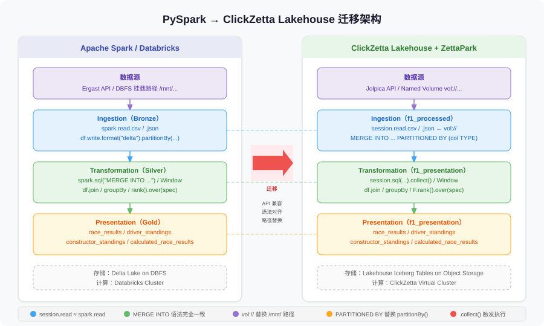

# spark2lakehouse-formula1

> PySpark → ClickZetta Lakehouse 完整迁移示例，以 F1 赛车数据工程项目为载体。

本项目 fork 自 [FerhattSimsekk/formula1-data-engineering](https://github.com/FerhattSimsekk/formula1-data-engineering)，在保留原始 Spark/PySpark 代码的基础上，新增了对应的 **ZettaPark（ClickZetta Python DataFrame SDK）实现**，将原项目完整迁移到 ClickZetta Lakehouse，并完成了端到端验证（71/71 验证项全部通过）。

---

## 迁移总结

### 整体结论

**迁移工作量低，API 兼容性高。** 原始 PySpark 代码约 90% 可以直接复用，改动集中在 4 个已知差异点。迁移后的代码在 `03_lakehouse/` 目录，可与 `01_spark/` 逐文件对照。

### API 兼容性

| 类别 | 兼容情况 | 说明 |
|------|---------|------|
| DataFrame 操作（select / filter / join / groupBy / sort） | ✅ 完全兼容 | 代码无需修改 |
| Window 函数（rank / dense_rank / row_number） | ✅ 完全兼容 | 仅替换导入路径 |
| 聚合函数（sum / count / avg / max / min） | ✅ 完全兼容 | 代码无需修改 |
| MERGE INTO 语法 | ✅ 完全兼容 | 标准 SQL，行为一致 |
| `withColumn` | ✅ 0.1.5 已修复 | 旧版本需改用 `select().alias()` |
| `session.sql()` 惰性执行 | ⚠️ 设计差异 | DDL/DML 必须加 `.collect()` |
| 多表 JOIN 列名前缀 | ✅ 0.1.5 已修复 | 推荐仍用 `df["col"].alias("col")` |
| `saveAsTable` 对新表 | ✅ 0.1.5 已修复 | 需 MERGE 语义时仍用封装函数 |
| 分区写入 `partitionBy()` | ⚠️ 不支持 | 改用 `PARTITIONED BY` 手写 DDL |
| `CREATE TEMP VIEW` | ⚠️ 不支持 | 改用 `df.create_or_replace_temp_view()` |
| 文件路径 | ⚠️ 格式不同 | `/mnt/...` → `vol://schema.vol/...` |

### 必须修改的 4 处

```python
# 1. 导入路径替换（机械替换，无逻辑改动）
from pyspark.sql import functions as F          # 改为
from clickzetta.zettapark import functions as F

from pyspark.sql.window import Window           # 改为
from clickzetta.zettapark.window import Window

# 2. session 显式创建（Databricks 中 spark 是全局注入的）
session = Session.builder.configs({...}).create()

# 3. DDL/DML 必须加 .collect()
session.sql("MERGE INTO ...").collect()         # ⚠️ 不加则不执行

# 4. 文件路径格式
session.read.csv("vol://f1_raw.formula1_raw_vol/raw/circuits.csv")  # 替换 /mnt/...
```

### 数据源兼容性

原始项目使用 Ergast API（已停服），本项目改用 Jolpica API，有以下差异需处理：

| 差异点 | 原始数据 | Jolpica API | 处理方式 |
|--------|---------|-------------|---------|
| 主键类型 | 整数 ID | 字符串 ref（如 `"hamilton"`） | JOIN 条件改用 ref 字段 |
| 文件格式 | CSV / JSON 数组 | NDJSON（每行一条） | 下载时逐行写入 |
| drivers 覆盖范围 | 与 results 匹配 | 全局端点只返回 100 条（字母序） | 改用按赛季端点下载后合并去重 |
| lap_times milliseconds | 有 | 无 | 填充 0，保留字段 |
| results 重复记录 | 无 | 偶有 | ingestion 层加 `dropDuplicates(["race_id", "driver_id"])` |

详细说明见 [`02_migration/`](02_migration/) 目录。

---

## 迁移架构



---

## 项目结构

```
spark2lakehouse-formula1/
├── 01_spark/                    # 原始 Spark/PySpark 代码（只读参考）
├── 02_migration/                # 迁移说明文档
│   ├── 01_overview.md           #   迁移概述与关键差异
│   ├── 02_syntax_mapping.md     #   PySpark ↔ ZettaPark 语法对照
│   ├── 03_zettapark_pitfalls.md #   ZettaPark 踩坑与最佳实践
│   └── 04_data_compatibility.md #   Jolpica API 数据兼容性问题
├── 03_lakehouse/                # ✅ ZettaPark 实现（完整可运行）
│   ├── includes/                #   公共函数和配置
│   ├── 01_ingestion/            #   数据摄取（ZettaPark）
│   │   └── download_lap_times_qualifying.py  # 从 Jolpica API 补充下载
│   ├── 02_transformation/       #   数据转换（ZettaPark + Lakehouse SQL）
│   ├── setup.py                 #   一键初始化（建 Volume + Schema + 下载数据）
│   ├── upload_to_volume.py      #   上传本地 datasets/raw/ 到 Volume
│   ├── reset.py                 #   清空所有 processed / presentation 表
│   └── e2e.py                   #   端到端全流程运行（上传 → 摄取 → 转换）
├── datasets/
│   └── raw/                     #   原始数据文件（CSV + NDJSON，2018–2023 赛季）
└── README.md
```

---

## 数据架构

| 层 | Schema | 表 |
|----|--------|----|
| Processed | `f1_processed` | circuits、races、drivers、constructors、results、pit_stops、lap_times、qualifying |
| Presentation | `f1_presentation` | race_results、driver_standings、constructor_standings、calculated_race_results |

数据覆盖 **2018–2023 赛季，125 场比赛**，来源：[Jolpica API](https://jolpi.ca)。

### 实际数据量

| 表 | 行数 | 说明 |
|----|------|------|
| circuits | 78 | 34 个国家 |
| races | 125 | 2018–2023 |
| drivers | 37 | 2018–2023 参赛车手 |
| constructors | 15 | 2018–2023 参赛车队 |
| results | 2,500 | 2018–2023 全赛季 |
| pit_stops | 4,294 | 2018–2023 全赛季 |
| lap_times | 134,957 | 2018–2023，125 场 |
| qualifying | 2,497 | 2018–2023，125 场 |

---

## 快速开始

### 前置条件

- Python 3.12+（最低 3.10）
- ClickZetta Lakehouse 账号（[免费注册](https://www.yunqi.tech)）

```bash
pip install clickzetta_zettapark_python python-dotenv
```

### 配置

在项目根目录创建 `.env`：

```
CLICKZETTA_USERNAME=your_username
CLICKZETTA_PASSWORD=your_password
CLICKZETTA_SERVICE=cn-shanghai-alicloud.api.clickzetta.com
CLICKZETTA_INSTANCE=your_instance_id
CLICKZETTA_WORKSPACE=your_workspace
CLICKZETTA_SCHEMA=your_schema
CLICKZETTA_VCLUSTER=default_ap
```

---

## 场景一：全新环境，从零开始

适合第一次运行，或想彻底重建的情况。

```bash
cd 03_lakehouse

# 步骤 1：初始化 Volume 和 Schema（只建 Volume + Schema，跳过数据下载）
python setup.py --skip-download

# 步骤 2：下载数据（2018–2023 全赛季，约 20 分钟）
# Jolpica API 按赛季分页，需要逐场下载
python 01_ingestion/download_results_pitstops.py       # results + pit_stops
python 01_ingestion/download_lap_times_qualifying.py   # lap_times + qualifying

# 步骤 3：E2E 全跑（上传 + 摄取 + 转换）
python e2e.py --reset
```

---

## 场景二：数据文件已备好，直接入仓

适合已有 `datasets/raw/` 文件，只需跑 pipeline 的情况。

```bash
cd 03_lakehouse

# 全流程（上传 Volume → 摄取 → 转换）
python e2e.py

# 或分步执行：
python upload_to_volume.py
python 01_ingestion/0.ingest_all_files.py
python 02_transformation/0.transform_all.py
```

---

## 场景三：重跑（清空后全量）

适合数据有问题、需要从头重建的情况。

```bash
cd 03_lakehouse

# 方式 A：一键
python e2e.py --reset --skip-upload   # 已上传过文件则跳过上传

# 方式 B：分步（更灵活）
python reset.py                        # 清空所有表（有 --dry-run 预览模式）
python 01_ingestion/0.ingest_all_files.py
python 02_transformation/0.transform_all.py
```

预览将要清空的内容（不实际执行）：

```bash
python reset.py --dry-run
```

---

## 场景四：增量更新

适合已有数据、只需合并新数据的情况。`merge_delta_data()` 封装了 MERGE INTO 语义，直接跑 ingest 即可，重复数据会被更新而不是插入。

```bash
cd 03_lakehouse
python 01_ingestion/0.ingest_all_files.py
python 02_transformation/0.transform_all.py
```

---

## 场景五：完整清理（测试完成后）

清理所有 Lakehouse 对象（表、视图、schema、volume）：

```bash
cd 03_lakehouse

# 清空所有表和视图（保留 schema 和 volume，可重跑）
python reset.py

# 完整清理（包括 schema 和 volume）
python teardown.py

# 预览将要删除的内容（不实际执行）
python teardown.py --dry-run
```

## 脚本说明

| 脚本 | 作用 |
|------|------|
| `setup.py` | 一键初始化：建 Volume + Schema（`--skip-download` 跳过数据下载） |
| `upload_to_volume.py` | 将 `datasets/raw/` 上传到 Lakehouse Volume |
| `reset.py` | 清空所有 processed / presentation 表和视图（保留 schema/volume） |
| `teardown.py` | 完整清理：删除 schema、volume 及所有对象 |
| `e2e.py` | 端到端全流程：上传 → 摄取 → 转换 → 汇总 |
| `01_ingestion/0.ingest_all_files.py` | 运行所有摄取脚本 |
| `02_transformation/0.transform_all.py` | 运行所有转换脚本 |
| `01_ingestion/download_results_pitstops.py` | 从 Jolpica API 下载 results + pit_stops（逐场） |
| `01_ingestion/download_lap_times_qualifying.py` | 从 Jolpica API 下载 lap_times + qualifying（逐场） |
| `01_ingestion/fix_drivers_constructors.py` | 从 Jolpica API 按赛季下载 drivers + constructors |

---

## 迁移兼容性

详见 `02_migration/` 目录。主要差异：

| 项目 | PySpark | ZettaPark | 状态 |
|------|---------|-----------|------|
| 文件路径 | `/mnt/...` 或 `dbfs:/...` | `vol://schema.vol/...` | 路径格式不同 |
| SQL 执行 | `spark.sql(q)` 立即执行 | `session.sql(q).collect()` | 必须加 `.collect()` |
| 临时视图 | `CREATE TEMP VIEW` | `df.create_or_replace_temp_view()` | SQL 语法不支持 |
| 分区表 | `partitionBy("col")` | `PARTITIONED BY (col TYPE)` | 需手写 DDL |
| DataFrame 操作 | PySpark API | ZettaPark API（同名） | ✅ 完全一致 |
| MERGE INTO | Delta Lake | 标准 SQL | ✅ 完全一致 |

---

## 数据集说明

`datasets/raw/` 包含从 [Jolpica API](https://jolpi.ca) 下载的 F1 数据：

| 文件 | 格式 | 赛季覆盖 |
|------|------|---------|
| `circuits.csv` | CSV | 历史全量（78 条） |
| `races.csv` | CSV | 2018–2023（125 场） |
| `drivers.json` | NDJSON | 2018–2023 参赛车手（37 人，由 `fix_drivers_constructors.py` 生成） |
| `constructors.json` | NDJSON | 2018–2023 参赛车队（15 支，由 `fix_drivers_constructors.py` 生成） |
| `results.json` | NDJSON | 2018–2023（2,500 条，由 `download_results_pitstops.py` 下载） |
| `pit_stops.json` | NDJSON | 2018–2023（4,294 条，由 `download_results_pitstops.py` 下载） |
| `lap_times.json` | NDJSON | 2018–2023（134,957 条，由 `download_lap_times_qualifying.py` 下载） |
| `qualifying.json` | NDJSON | 2018–2023（2,497 条，由 `download_lap_times_qualifying.py` 下载） |

> **注意**：Jolpica API 全局 `/drivers.json?limit=1000` 实际只返回 100 条（按字母序），
> 无法覆盖 2018–2023 的参赛车手。必须用 `fix_drivers_constructors.py` 按赛季下载。

---

## 原始项目

- 原始作者：[FerhattSimsekk](https://github.com/FerhattSimsekk)
- 原始 Repo：[formula1-data-engineering](https://github.com/FerhattSimsekk/formula1-data-engineering)
- 技术栈：Azure Databricks、PySpark、Spark SQL、Delta Lake
- License：MIT
